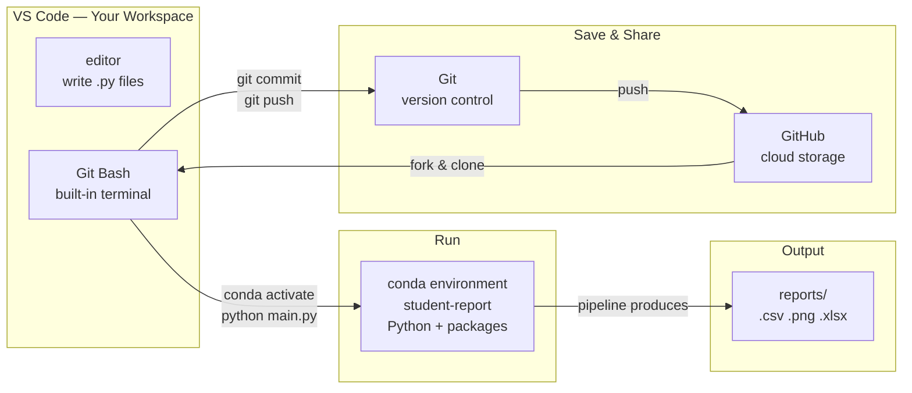

# Before You Begin — Environment Setup

## Introduction

This document walks you through everything you need to do before Session 1. By the time you finish, you will have four tools installed and verified, a GitHub account, and your own copy of the workshop code ready to go.

Complete these steps on your own before the first session. If you run into problems, see the [Getting Help](#getting-help) section at the bottom.

---

## The Tool Stack

This workshop uses four tools. Each one has a specific job; none of them overlap. You do not need to install Python separately — it comes bundled with Miniconda.

**VS Code** is the code editor. It is where you will read and write Python files. It also has a built-in terminal panel where you run all your commands without switching windows.

**Git Bash** is a command-line terminal for Windows that is included automatically when you install Git. You will use it as the built-in terminal inside VS Code. Every command you run in this workshop — activating the conda environment, running Python scripts, committing your work — happens here.

**Miniconda (conda)** is an environment manager. It installs Python and creates an isolated environment — a named set of packages at specific versions — so that this project's dependencies do not interfere with anything else on your computer. Every participant runs the exact same version of every package.

**Git** is version control. It records every change you make to your code so you can see what changed, when, and why — and undo it if something breaks.

**GitHub** is a cloud platform for storing and sharing Git repositories. It is where the workshop code lives and where you will back up your work. You need a free account; no software installation required.

### How They Connect



You write Python files in the VS Code editor. Git Bash — running as the built-in terminal inside VS Code — is where you type commands. Those commands activate the conda environment to run your code, produce the output files, and save your work to Git and GitHub.

---

## A Note on GSU Managed Machines

GSU-managed computers may require administrator credentials to install software. If any installer prompts for a password you do not have, contact the [GSU Technology Help Desk](https://technology.gsu.edu/about/contact/) and ask them to install Miniconda, Git, and VS Code before Session 1.

Allow **30–60 minutes** for the full setup, not including any IT wait time.

---

## Installation Steps

Open each installer and follow the steps below. All steps assume a **Windows 11** machine.

### Step 1 — Miniconda

Miniconda installs both `conda` and Python. You do not need to install Python separately.

1. Download the latest **64-bit Windows** installer from the [Miniconda download page](https://docs.conda.io/projects/miniconda/en/latest/miniconda-other-installer-links.html). Select the most recent version.
2. Run the installer. When you reach the **Advanced Installation Options** screen, check **"Add Miniconda3 to your PATH environment variable."** Accept all other defaults.
3. Click **Install**, then **Finish**.
4. Open a new **Command Prompt** (`Win + R`, type `cmd`, press Enter) and run:
   ```
   conda --version
   ```
   You should see output like `conda 24.x.x`. If you see an error, re-run the installer and confirm the PATH option was checked.

> **Video walkthrough:** [Downloading and Installing Miniconda3](https://www.youtube.com/watch?v=-H_onyfW9VE)

---

### Step 2 — Git and Git Bash

Git Bash is included automatically with the Git for Windows installer — no separate download is needed.

1. Download the **Windows** installer from the [Git download page](https://git-scm.com/downloads). Select the most recent version at the top of the page.
2. Run the installer. Accept all default options on every screen. On the **Choosing the terminal emulator** screen, confirm that **"Use MinTTY (the default terminal of MSYS2)"** is selected — this is Git Bash.
3. Click **Install**, then **Finish**.
4. Open a new **Command Prompt** and run:
   ```
   git --version
   ```
   You should see output like `git version 2.x.x`.

> **Video walkthrough:** [Installing Git on Windows](https://youtu.be/4xqVv2lTo40?si=GVTTywH1x-hzSGE6&t=33)

---

### Step 3 — Visual Studio Code

1. Download the **Windows** installer from the [VS Code download page](https://code.visualstudio.com/download).
2. Run the installer and accept all default options.
3. **Reboot your computer** before continuing.
4. Open a new **Command Prompt** and run:
   ```
   code --version
   ```
   You should see a version number on the first line (e.g., `1.9x.x`).

#### Set Git Bash as the built-in terminal

VS Code detects Git Bash after installation but does not set it as the default terminal automatically. Do this once:

1. Open VS Code.
2. Open Settings with `Ctrl + ,`.
3. Search for `terminal.integrated.defaultProfile.windows`.
4. In the dropdown, select **Git Bash**.
5. Open a new terminal with `` Ctrl + ` `` (backtick). The terminal panel should show `bash` in the upper right.

> **Video walkthrough:** [Installing VSCode on Windows](https://www.youtube.com/watch?v=CPmQwlycfGI)

---

### Step 4 — GitHub Account

1. Go to [github.com](https://github.com) and click **Sign Up**.
2. Follow the prompts to create a free personal account.
3. Verify your email address when GitHub sends you a confirmation message.

You do not need a paid plan or an organization account. A free personal account is all that is required.

---

## Setup Checks

Before Session 1, confirm all three tools are working. Open **Git Bash** (search for "Git Bash" in the Windows Start menu) and run each command:

| Command | Expected output |
|---|---|
| `conda --version` | `conda 24.x.x` (or similar) |
| `git --version` | `git version 2.x.x` (or similar) |
| `code --version` | A version number, e.g. `1.9x.x` |

Running these checks in Git Bash — rather than Command Prompt — also confirms that Git Bash itself is working correctly.

If any command returns an error or `command not found`, see [Getting Help](#getting-help) below before Session 1.

---

## Fork the Workshop Repo

Forking creates your own copy of the workshop code on GitHub. Your changes stay in your fork and do not affect anyone else.

1. Go to [github.com/GSU-Analytics/automating-analytics-workshop](https://github.com/GSU-Analytics/automating-analytics-workshop).
2. Click the **Fork** button in the upper right.
3. Accept the defaults and click **Create fork**.

Your fork will appear at:
```
https://github.com/YOUR-USERNAME/automating-analytics-workshop
```

**Stop here.** You will clone your fork to your computer at the start of Session 2, under instructor guidance.

---

## Getting Help

If setup is not complete before Session 1, bring your laptop and let the instructor know at the start of the session.

| Issue | Contact |
|---|---|
| Can't install software (no admin rights) | GSU Technology Help Desk — [technology.gsu.edu](https://technology.gsu.edu/about/contact/) |
| Pre-workshop questions and troubleshooting | [TBD — Teams channel link] |
| Office hours | Directly after each workshop session |

**Teams channel:** The workshop has a dedicated Microsoft Teams channel for questions, troubleshooting, and announcements. Join before Session 1 so you have a place to ask for help with setup. The link to join is [TBD].

---

## VPN (Off-Campus Only)

VPN is **not required** during workshop sessions. When you are on campus and connected to GSU WiFi, your computer is already within the GSU network and can reach the training database used in Sessions 4 and 5.

If you plan to work on exercises off-campus, you will need to connect via VPN first. Setup instructions are on the [GSU Technology — Virtual Private Network](https://technology.gsu.edu/technology-services/cybersecurity/virtual-private-network/) page.

---

## Additional Resources

**Cheat sheets**
- [Conda cheat sheet](https://docs.conda.io/projects/conda/en/latest/_downloads/843d9e0198f2a193a3484886fa28163c/conda-cheatsheet.pdf)
- [Git cheat sheet](https://education.github.com/git-cheat-sheet-education.pdf)
- [VS Code keyboard shortcuts — Windows](https://code.visualstudio.com/shortcuts/keyboard-shortcuts-windows.pdf)
- [Windows Command Line cheat sheet](https://drive.google.com/file/d/1qoAbZb0M2Adka2f--JoqIXps_SWZNJX8/view)

**Video walkthroughs**
- [Downloading and Installing Miniconda3](https://www.youtube.com/watch?v=-H_onyfW9VE)
- [Installing Git on Windows](https://youtu.be/4xqVv2lTo40?si=GVTTywH1x-hzSGE6&t=33)
- [Installing VSCode on Windows](https://www.youtube.com/watch?v=CPmQwlycfGI)

**Full environment setup reference**
- [GSU Analytics — Python Environment Setup](https://github.com/GSU-Analytics/python_guides/wiki/Python-Environment-Setup) (general reference; this module supersedes it for workshop-specific setup)
